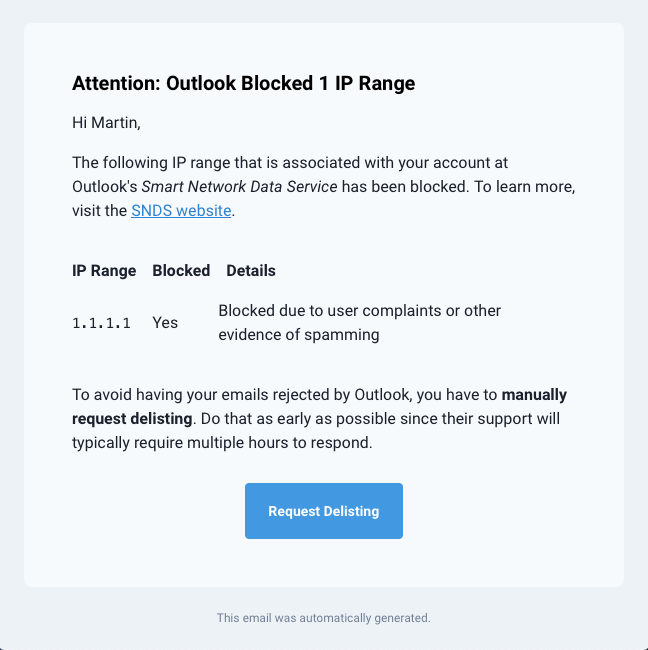

# Outlook Postmaster Query

This Python script makes it easy to discover if your outgoing SMTP server is being blocked by Microsoft's 
**Outlook.com** email infrastructure. It queries the _Smart Network Data Service_ API and alerts you via email if
any of your SMTP servers are blacklisted by Microsoft.

### Example Notification

When the script detects that one of your IPs is blocked, it will notify the recipients configured in your `.env` via email:

```yaml
recipients:
- name: Jane Doe
  email: jane.doe@example.com
- name: Jon Doe
  email: jon.doe@example.com
```

The notification looks something like this:



## Motivation

While administrating multiple small email servers, I experienced that Microsoft is pretty aggressive in their 
blacklisting of outgoing SMTP servers even though they might rarely see any traffic from them. The result is that
your users cannot reach any email addresses ending with `@hotmail.com`, `@outlook.com` and some others. Unfortunately,
Microsoft does not share why they block certain IP addresses or IP ranges. Since I don't have any problems with any
other email hosting providers whatsoever, I have to assume my SMTP servers are being unfairly targeted. I have checked
my logs every time Microsoft decided to block any of my servers' IPs, by the way. Nothing "spammy" was ever sent from
those machines.

My solution is this script that queries the API of Outlook's _Smart Network Data Service_ and alerts me if any of my
registered IPs currently being blocked by their system.

## Prerequisites

The first step is to register at Outlook.com's _Smart Network Data Service_ on their 
[website](https://sendersupport.olc.protection.outlook.com/snds/). Next, associate our IP (ranges) with your account on
the _Request Access_ tab. Now go to the _Edit Profile_ tab and click on the link to change your 
**automated access settings** under _Automated Access_. Enable automated access and save the API key that is generated.
The API key's format looks like this: `XXXXXXXX-XXXX-XXXX-XXXX-XXXXXXXXXXXX`

## Installation

To install the software, you have to perform the following steps:

1. Clone the repository.
    ```bash
    git clone https://github.com/martbock/outlook-postmaster-query.git
    cd outlook-postmaster-query/
    ```
2. Create a virtual environment, activate it and install the dependencies.
    ```bash
    python3 -m venv venv
    source venv/bin/activate
    pip install -r requirements.txt
    ```
3. Copy the `env.example.yml` file to `env.yml`. This yaml-formatted file holds your specific configuration.
    ```bash
    cp env.example.yml env.yml
    nano env.yml
    ```
4. Enter the API Key at the config path `outlook.api.key`.
5. Run the script to check for syntactical correctness of your configuration file.
    ```bash
    python3 app.py
    ```
6. Create a cron job for automatically running the query.